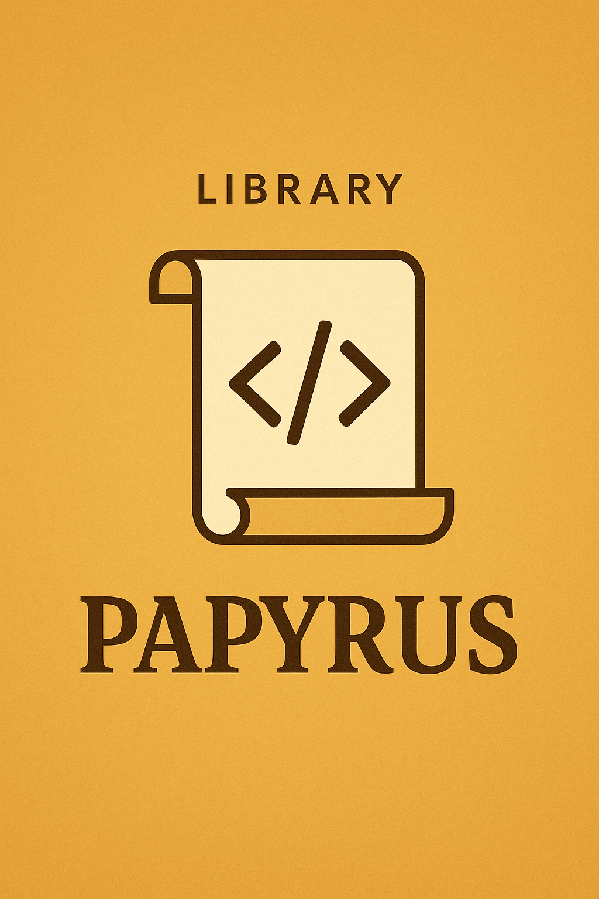

# Introduzione

Papyrus è una libreria scritta in Scala per creare documenti in modo dichiarativo.  
L’idea è offrire qualcosa di semplice da usare e leggibile, ma abbastanza solido da generare documenti completi (PDF o HTML).

---

## Obiettivi

- Creare una libreria che permetta di descrivere documenti usando codice leggibile
- Supportare la generazione in PDF e HTML
- Offrire strumenti pratici per titoli, sezioni, testi, stili, elenchi, immagini e tabelle
- Rendere tutto utilizzabile anche senza essere esperti Scala
- Lavorare in team con metodologia agile e testare idee progettuali in modo concreto

## get Started

Per iniziare a utilizzare Papyrus in un nuovo SBT project, puoi seguire questi passaggi:

- generare un nuovo progetto SBT.
- scaricare il JAR dall'ultima release di Papyrus su GitHub.
- aggiungere il JAR al tuo progetto SBT.
- aggiungere la dipendenza di Papyrus a `build.sbt`.
- creare un object che estende `papyrus.dsl.DSL.PapyrusApplication`:

```scala
  import papyrus.dsl.DSL.PapyrusApplication

  object TestPapyrus extends PapyrusApplication:

    papyrus:
      ...
```


<!--  -->
