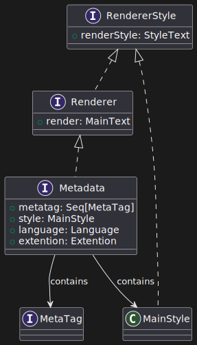

# Struttura

## Papyrus struttura

Papyrus è l'elemento principale della libreria, che funge da punto d'ingresso per la creazione di documenti e permette una volta inseriti tutti i componenti di generare il documento richesto. La sua struttura è organizzata nella seguente gerarchia:

## Metadata struttura

Metadata rappresenta i metadati del documento, come titolo, autore, lingua, stile globale, ecc. È un componente essenziale che definisce le proprietà generali del documento e il suo aspetto visivo. La sua struttura è organizzata nella maniera seguente:

## Content struttura

Content rappresenta il contenuto principale del documento, che può includere sezioni, sottosezioni, testo, immagini, tabelle e altri elementi. È responsabile della composizione e dell'organizzazione del contenuto in modo strutturato. La sua struttura è organizzata nella maniera seguente:

