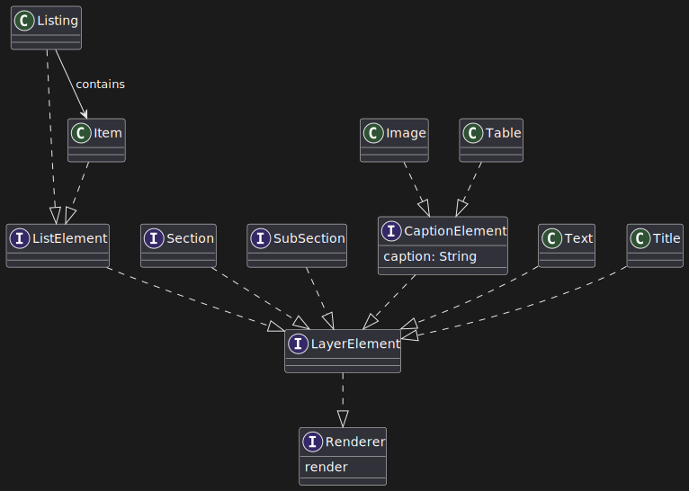

# Design di dettaglio

## Struttura del progetto

La libreria Papyrus è strutturata in quattro componenti principali:

- **DSL**: Espone all’utente tutte le keyword e funzioni utilizzabili per scrivere un documento (es. `text`, `image`, `listing`, `section`, ecc.). Implementa la sintassi e la semantica del linguaggio.

- **Builder**: Include tutti i costruttori tip-safe degli elementi del DSL (es. `TextBuilder`, `TitleBuilder`, `ListBuilder`), ciascuno con stato immutabile, metodi di configurazione e `build()` finale.

- **Elementi**: Contiene le rappresentazioni finali degli oggetti documentali (es. `Title`, `Text`, `Section`, `Image`, `Table`) con i metodi `render` per l’HTML e `renderStyle` per il CSS.

- **Utils**: Componenti trasversali di supporto, come `PapyrusPrinter` (per la generazione dei file), i counter di sezione (`SectionCounter`), i tipi raffinati (tramite **Iron**), e i valori di default stilistici.


## Core della libreria

Il core della libreria è costituito da tre entità fondamentali:

- `Papyrus`: trait principale che unisce `metadata` e `content`. Contiene il metodo `build()` che attiva la generazione del documento finale (HTML, CSS, PDF).

- `Metadata`: raccoglie le informazioni globali del documento (es. titolo, autore, lingua, margini, font, colori, ecc.) e genera lo stile globale associato al `<body>` e all’header HTML.

- `Content`: ospita tutti gli elementi strutturali e visuali del documento (es. sezioni, testo, elenchi, immagini), mantenuti come `LayerElement`. Ogni elemento fornisce il proprio contenuto e stile.


---

## DSL

Il modulo `DSL` contiene l'intero linguaggio di composizione documentale. Ogni keyword è una funzione che:

- apre un builder specifico;
- impone vincoli di contesto tramite `using`;
- aggiunge l’elemento al contesto padre.

Le keyword sono suddivise in:

- **Strutturali**: `papyrus`, `metadata`, `content`, `section`, `subsection`;
- **Testuali**: `title`, `text`, `bold`, `italic`, `underline`, `font`, `fontSize`, `textAlign`, ecc.;
- **Layout**: `image`, `table`, `listing`, `item`, `margin`, `backgroundColor`;
- **Meta**: `author`, `language`, `charset`, `extension`, `path`, `nameFile`.

### Integrazioni e stile DSL

Ogni keyword del DSL Papyrus è collegata a un builder sottostante che ne definisce la struttura e lo stile. Un caso emblematico è quello di `text`, progettata per la creazione di blocchi testuali personalizzabili. Il sistema sfrutta **extension visibili direttamente nel DSL** per configurare dinamicamente il contenuto.

Ad esempio, la riga:
```scala
text: 
  "Testo dimostrativo" fontWeight "bold"
```

genera un elemento `Text` con il contenuto specificato, applicando uno stile grassetto. Ciò avviene grazie all’associazione della stringa a un `TextBuilder`, su cui vengono applicati dinamicamente gli stili. Il DSL definisce extension per proprietà come:
- `fontWeight`
- `fontStyle`
- `textDecoration`
- `color`
- `newLine`

Questa architettura consente una sintassi naturale e leggibile, mantenendo al tempo stesso una struttura **immutabile e tip-safe**.

Ogni builder opera in un **contesto limitato**, determinato tramite `using`, e a build completata restituisce un elemento (es. `Text`) dotato dei metodi `render` e `renderStyle`. Il primo produce l’HTML, il secondo genera il CSS — entrambi inclusi poi nel documento finale tramite la logica di `PapyrusPrinter`.


Ogni keyword opera in un contesto limitato (es. `subsection` è valida solo dentro `section`) e questo è **garantito a compile-time** con vincoli dichiarati nei tipi impliciti (`using`). Non esistono controlli runtime.

Per chiarimenti sulla struttura ad albero o sull'EBNF consultare la [grammatica.](https://pps-24-papyrus.github.io/PPS-24-papyrus/report/11-grammatica.html)


---

## Builders

Ogni elemento del DSL ha un builder associato che espone:

- uno stato immutabile rappresentato da parametri (es. `text`, `fontSize`, `color`, `alignment`);
- metodi `with*` per modificarlo in modo puro;
- un metodo `build()` che restituisce l’istanza finale (es. `Text`, `Image`, `List`, ecc.).

Esempi di builder: `TitleBuilder`, `TextBuilder`, `ListBuilder`, `ImageBuilder`, `MetadataBuilder`, `ContentBuilder`.


---

## Elementi

Gli oggetti finali costruiti dai builder sono rappresentazioni passive del documento e implementano due metodi chiave:

- `render`: restituisce l’HTML come stringa tipizzata (`MainText`);
- `renderStyle`: restituisce il CSS come stringa tipizzata (`StyleText`).


Il rendering complessivo del documento è ricorsivo: ogni elemento concatena i render dei figli.



---

## PapyrusPrinter (Rendering & Export)

La generazione dei file è delegata al modulo `PapyrusPrinter`, che gestisce:

- la creazione fisica dei file HTML (`nameFile.html`) e CSS (`style.css`);
- il salvataggio in una directory fornita dall’utente oppure, in mancanza, in una cartella temporanea;
- l’**apertura automatica del file** nel browser o visualizzatore PDF di sistema.

Quando richiesto un PDF, il sistema:

1. genera HTML e CSS come nei documenti HTML;
2. utilizza un wrapper attorno a `openhtmltopdf` e `flying-saucer-pdf` per convertire l’HTML;
3. apre il file PDF generato.

L’utente non ha bisogno di configurare nulla: il comportamento è implicito e automatico.

---

## Gestione degli errori

Il sistema garantisce:

- **tip-safety** tramite i vincoli nel DSL: keyword errate o fuori contesto generano errori di compilazione;
- **validazione raffinata** su valori come colore, allineamento, dimensione font, ecc. grazie a **Iron**;
- gestione elegante delle immagini: se il file non esiste, viene comunque visualizzato il `text-alt` definito nel DSL.

---

## Wrapping librerie esterne

Papyrus **non chiama mai direttamente librerie esterne**. Tutte le dipendenze (es. per generazione PDF, validazione, filesystem) sono racchiuse in wrapper dedicati. Questo approccio:

- migliora la testabilità,
- riduce il coupling,
- centralizza i punti di manutenzione.

Esempi di wrapping:

- `PapyrusPrinter` incapsula le librerie PDF;
- `Iron` è usato tramite tipi specializzati (`refined`) per colore, font size, linguaggio, charset…;
- il file system è astratto tramite `better-files`.


