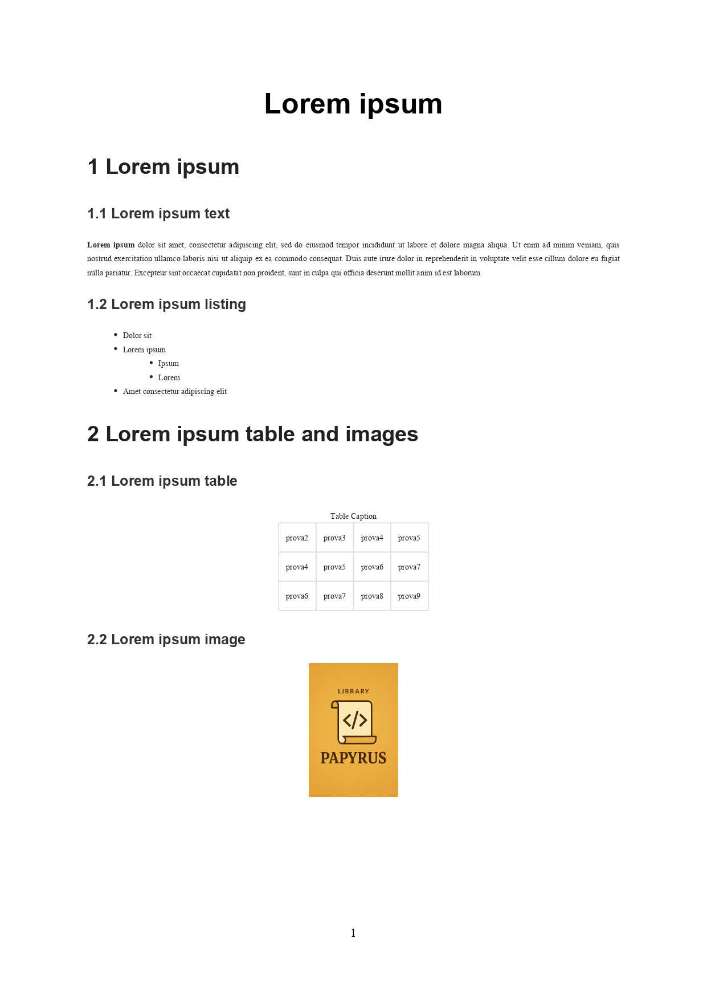

# Esempio di utilizzo di Papyrus

## Input
```scala
import papyrus.dsl.DSL.PapyrusApplication

object Main extends PapyrusApplication:

    papyrus:
      metadata:
        nameFile:
          "Papyrus"
        language:
          "en"
        extension:
          "pdf"
        fontSize:
          9
        margin:
          50
      content:
        title:
          "Lorem ipsum"
        section:
          title:
            "Lorem ipsum"
          subsection:
            title:
              "Lorem ipsum text"
            text:
              "Lorem ipsum" fontWeight "bold"
            text:
              "dolor sit amet, consectetur adipiscing elit, sed do eiusmod tempor incididunt ut labore et dolore magna aliqua. Ut enim ad minim veniam, quis nostrud exercitation ullamco laboris nisi ut aliquip ex ea commodo consequat. Duis aute irure dolor in reprehenderit in voluptate velit esse cillum dolore eu fugiat nulla pariatur. Excepteur sint occaecat cupidatat non proident, sunt in culpa qui officia deserunt mollit anim id est laborum."
          subsection:
            title:
              "Lorem ipsum listing"
            listing:
              ordered:
                "length"
              item:
                "Lorem ipsum"
              listing:
                ordered:
                  "alphabetical"
                item:
                  "Lorem"
                item:
                  "Ipsum"
              item:
                "Dolor sit"
              item:
                "Amet consectetur adipiscing elit"
        section:
          title:
            "Lorem ipsum table and images"
          subsection:
            title:
              "Lorem ipsum table"
            table:
              "prova2" | "prova3" | "prova4" | "prova5"
              "prova4" | "prova5" | "prova6" | "prova7"
              "prova6" | "prova7" | "prova8" | "prova9"
              captionTable:
                "Table Caption"
          subsection:
            title:
              "Lorem ipsum image"
            image:
              "src/main/resources/PapyrusLogo.png" alternative "Image not found" width 100
```
## Output

