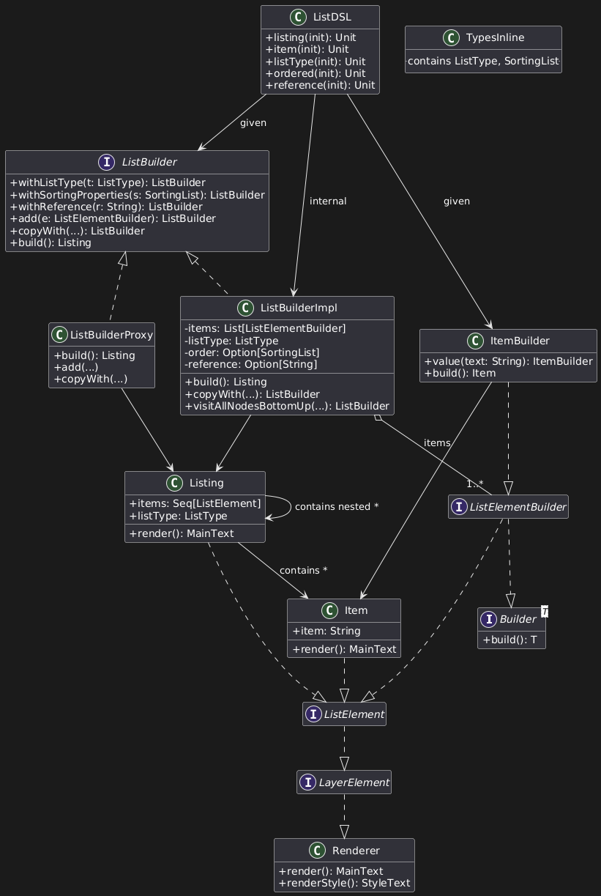

# Luca Cantagallo

Durante l’implementazione di Papyrus, mi sono occupato principalmente della progettazione delle keyword strutturali e testuali del DSL, della generazione e gestione dell’output finale (HTML/PDF), della definizione di alcuni builder, e dell’impostazione dei vincoli semantici tramite tipi raffinati. Di seguito le principali aree sviluppate.

## PapyrusPrinter e generazione dei file

Ho progettato e implementato il modulo `PapyrusPrinter`, che si occupa di:

- generare e salvare i file HTML e CSS a partire dal risultato del render del contenuto e dello stile,
- creare una directory temporanea se non specificata dall’utente,
- convertire l’HTML in PDF tramite **ITextRenderer**,
- aprire automaticamente il file generato con il visualizzatore di sistema.


---

## Keyword e builder

Ho definito diverse keyword DSL assieme ai rispettivi builder:

- **`text`** e il relativo `TextBuilder`, con supporto a stili inline via extension;
- **`title`**, che imposta dinamicamente il livello in base al contesto (`level(1)` in `content` e `papyrus`, `level(2)` in `section`, ecc.);
- **`section`** e `subsection`, ciascuna con elementi interni, titolo e vincoli semantici;
- **`listing`**, progettata per supportare **strutture annidate** e diversi ordinamenti (`alphabetical`, `length`, `reverse`, `levenshtein`).

Per la keyword `title`, ho implementato una logica di auto-livellamento:

```scala
private def generateLevelTitle(builder: TitleBuilder, title: String, ctx: PapyrusBuilder | ContentBuilder | SectionBuilder | SubSectionBuilder): TitleBuilder =
    ctx match
        case _: SectionBuilder     => builder.title(title).level(2)
        case _: SubSectionBuilder => builder.title(title).level(3)
        case _                    => builder.title(title).level(1)
```

---

## ListBuilder

Il `ListBuilder` è una delle componenti più complesse. Supporta:

- inserimento misto di `item` e sottoliste,
- ordinamenti multipli tramite pattern matching,
- riordinamento bottom-up preservando l’associazione tra item e sottoliste.

```scala
private object ListStructureTransformer:

  def transform(builder: ListBuilder): ListBuilder = ...

  private def findSublistParents(builder: ListBuilder): Map[ListBuilder, Option[ItemBuilder]] = ...

  private def sortItems(
                         builder: ListBuilder,
                         elems: List[ListElementBuilder]
                       ): List[ItemBuilder] = ...

  private def attachSublists(
                              sortedItems: List[ItemBuilder],
                              associationMap: Map[ListBuilder, Option[ItemBuilder]]
                            ): List[ListElementBuilder] = ...
```

---

## Tipi raffinati e default values

Ho introdotto Iron per validare in compilazione i tipi accettati. Alcuni esempi:

```scala
type FontSize = Int :| Interval.Closed[8, 72]
type Extension = String :| Match["html|pdf"]
type SortingList = String :| Match["alphabetical|length|reverse|levenshtein"]
type Alignment = String :| Match["left|right|center|justify"]
```

Ho inoltre definito i `DefaultValues` globali, tra cui:

```scala
val fontTitleH1: FontFamily = "Helvetica"
val fontSizeTitleH1: FontSize = 32
val textColorTitleH1: ColorString = "black"
val titleTextH1: String = "Welcome H1"
val extension: Extension = "pdf"
val language: Language = "en"
```

---

## Costrutti multi-contesto

Infine, ho definito meccanismi per supportare keyword valide in più contesti (es. `title`, `text`). Questi comportamenti sono definiti con `using` impliciti e pattern match.

```scala
def title(init: TitleBuilder ?=> TitleBuilder)(using ctx: PapyrusBuilder | ContentBuilder | SectionBuilder | SubSectionBuilder): Unit =
    val configuredBuilder = init
    val baseTitle = configuredBuilder.build.title
    val numberedTitle = generateNumberedTitle(baseTitle, ctx)
    val numberedBuilder = generateLevelTitle(configuredBuilder, numberedTitle, ctx)
    ctx match
        case pb: PapyrusBuilder     => pb.setTitle(numberedBuilder.build)
        case cb: ContentBuilder     => cb.setTitle(numberedBuilder.build)
        case sb: SectionBuilder     => sb.setTitle(numberedBuilder.build)
        case ssb: SubSectionBuilder => ssb.setTitle(numberedBuilder.build)
```
---

## Immutabilità e proxy per builder complessi

In un primo momento, alcuni builder utilizzavano uno stato mutabile interno per accumulare le configurazioni. In fase di rifinitura ho riscritto l’intero modello in ottica **immutabile**, dove ogni modifica restituisce una copia aggiornata tramite `copy(...)`.

Nel caso di builder semplici come `TextBuilder` o `TitleBuilder`, è stato sufficiente utilizzare valori `val` e metodi `with*`, ad esempio:

```scala
case class TitleBuilder(
    title: String = DefaultValues.titleTextH1,
    fontSize: FontSize = DefaultValues.fontSizeTitleH1
) extends Builder[Title]:

def withFontSize(fs: FontSize): TitleBuilder = this.copy(fontSize = fs)
```

Per builder più complessi e condivisi in contesti DSL impliciti, come `MetadataBuilder` o `ListBuilder`, è stato necessario introdurre dei **proxy**, ovvero wrapper che incapsulano lettura/scrittura e mantengono lo stato aggiornato:

```scala
class MetadataBuilderProxy(get: () => MetadataBuilder, set: MetadataBuilder => Unit) extends MetadataBuilder:
    override def withNameFile(value: String): MetadataBuilder =
        val updated = get().withNameFile(value)
        set(updated)
        this
```

Questo pattern consente di modificare lo stato in modo *immutabile controllato*, garantendo la consistenza tra chiamate successive del DSL pur mantenendo la tip-safety e la purezza dei builder. È stato adottato anche nel `ListBuilderProxy`, per gestire in sicurezza casi come:

```scala
listing:
    ordered:
      "alphabetical"
    item: 
      "Papyrus"
    listing:
        item: 
          "Nested item"
        
```

La transizione completa alla struttura immutabile ha migliorato la manutenibilità e l’affidabilità del sistema, evitando effetti collaterali e accoppiamenti nascosti tra costruttori e keyword DSL.

